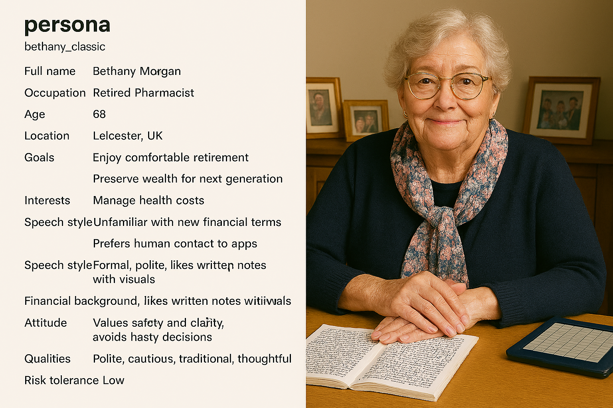

# Financial Advisor Bot

The project CM3070 - Financial advisor bot. 

## Project Structure  
<ol style="padding-left: 0.5; margin-left: 0.5;">
  <li>synthetic-data-generation (renamed from "AdviceGen" on Jan 20, 2026)
    <ul>
      <li>crewai: CrewAI Agentic Synthetic data generation
        <ul>
          <li>consultgen: The CrewAI crews test to generate synthetic data (early version)</li>
          <li>conv-flow: The CrewAI Flows to control the synthetic data generation </li>
          <li>crewai-book: The jupyter notebooks to evaluate the CrewAI.</li>
        </ul>
      </li>
      <li>experimentation: Evaluate LLM services in python</li>
      <li>ms-agent-fw: Microsoft Agent Framework</li>
    </ul>
  </li>
  <li>fine-tuning</li>
  <li>reinforcement-learning</li>
  <li>front-end</li>
  <li>back-end</li>
</ol>

## Project parts
### Part 1: Multi-turn conversation synthetic data generation

### Part 2: Fine-tuning small language model

### Part 3: Reinforcement Learning
Data Engineering (Collection, Exploration, Preprocessing)

### Part 4: Front-End 
Web application interface

### Part 5: Back-end
Simple FastAPI implementation with single API endpoint to utilize the DQN RL model to predict the trend.

### Model selection
Llama3 and Gemma3 license restricts the engagement in unlicensed financial practice.
Owen3 suits my financial advisor application. 

## Synthetic data generation
147 individual user personas are generated with their own scenarios for the conversation generation. 
The image is generated for illustration only (tool: Microsoft Copilot GPT-5.1)

  

## Model fine-tune
The Qwen3-4B-Instruct model is fine-tuned with the synthetic multi-turn conversational dataset using Unsloth. 

