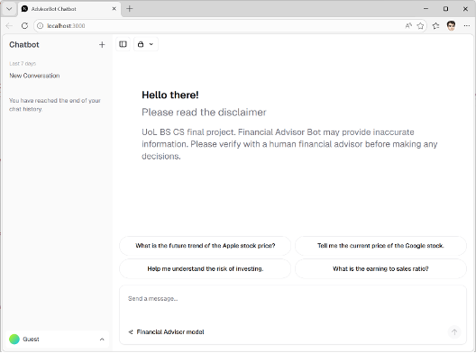

# AdvisorBot UI

I started with a new next.js project to practice and familiarize with the Vercel AI SDK, AI Elements.
I successfully tested to run my local model on ollama with AI SDK. Please note that the AdvisorBot-UI is not the one I used for my front-end user application.
I adapted the Vercel's Chatbot template (also using AI SDK, Next.js and AI Elements) for my front-end. See &#9875; [Chatbot AI App](#chatbot-template)

### &#128736; Setup

I used nvm to manage my local node version installation.

```shell
nvm install -lts
```

Installed the pnpm:

```shell
npm install -g pnpm
```

## Next.js and AI-SDK

### Installation

Follow along quickstart tutorial &#128073; [link](https://ai-sdk.dev/docs/getting-started/nextjs-app-router)

Added the Ollama provider:

```shell
pnpm add ai-sdk-ollama
```

Added AI Elements. Apparently, it added all components.

```bash
pnpm dlx ai-elements@latest
```

AI Elements documentation shows that individual components installation as:

```bash
npx ai-elements@latest add prompt-input
```

Install theme
https://ui.shadcn.com/docs/dark-mode/next

```bash
pnpm add next-themes
pnpm dlx shadcn@latest add sidebar
pnpm dlx shadcn@latest add sonner
```

# Chatbot AI App
</br>
I used the Vercel Chatbot template for my front-end application. The Chatbot template is kind of outdated though.
As an example, the template used next-auth module which is now part of [Better-Auth](https://better-auth.com/).
Well, I could just use the template as it is, but I wanted to make it up-to-date, and I also wanted to understand how the template was built.
</br>
I decided to update all the packages to the latest version (ignore versions in package.json):

```bash
pnpm update -L
```

[Upgraded next.js to 16.1.6](https://nextjs.org/docs/app/getting-started/upgrading)
[Upgraded drizzle ORM](https://orm.drizzle.team/docs/get-started/postgresql-new)
[Replaced Next-auth with Better Auth](https://better-auth.com/docs/installation)
[Installed SQLite Better-SQL3](https://orm.drizzle.team/docs/get-started-sqlite)

Installed the Prettier and TailwindCSS prettier for formatting (the template used biome):

```bash
pnpm add --save-dev --save-exact prettier
pnpm add -D prettier-plugin-tailwindcss
```

## Better Auth

By following the better auth documentation, I initialized the better auth with sqlite (drizzle) database and stateless session.

```bash
openssl rand -base64 32
```

Install better-auth

```bash
pnpm add better-auth
```

```env
BETTER_AUTH_SECRET=
```

Generated the schema for better-auth using following command. The schema file was created in root directory. I moved the schema to the @/lib/db/schema folder as I already had another schema file for Chatbot application tables.

```bash
npm dlx auth@latest generate
```

Generated and migrated:

```bash
pnpm exec drizzle-kit generate
pnpm exec drizzle-kit migrate
```

pnpm add ai-sdk-ollama

Links:
https://github.com/seaweedfs/seaweedfs/wiki/nodejs-with-Seaweed-S3
AWS SDK Client Credentials
https://github.com/aws/aws-sdk-js-v3/blob/main/supplemental-docs/CLIENTS.md
https://docs.aws.amazon.com/AWSJavaScriptSDK/v3/latest/client/s3/command/PutObjectCommand/

### SQLite

The sqlite is initialized through the drizzle migration. &#9757; The drizzle.config.js file contains the configuration for the database.</br>

To remove the user and session database entries:

1. Installed the sqlite3 on local system

```shell
sudo apt install sqlite3
```

2. Used Sqlite3 to manage the database table entries for fresh start after tests.

```shell
SELECT * FROM user;
SELECT * FROM session;
DELETE FROM user;
DELETE FROM session;
.quit
```
